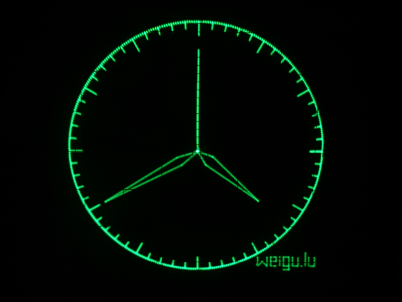

# Osciclock

## All infos on: <http://weigu.lu/microcontroller/osciclock/index.html>

## Some infos

Old Oscilloscopes want to live forever. To do so, here is the oscilloscope clock. The code is written to get a clear image of a clock with no ghost lines. The hands are drawn beginning from the origin and back to the origin. Strokes are drawn during drawing the circle.

Teensy 3.6 with internal RTC is quick enough to use mathematical functions. With his two 12 Bit DAC, the picture is rock stable and sharp. The only hardware needed is an external battery for the RTC (osciclock_teensy36_without_esp).

The Teensy has no direct connection to the Internet and no DCF77, so the time may be getting imprecise over the year. So the best solution is the Teensy with an ESP8266 or ESP32 to get time updates from an NTP server (osciclock_teensy36_ntp for the teensy an osciclock_teensy36_esp_ntp_code for the ESP).

An ESP8266 or ESP32 is sending once an hour the time to the Teensy over hardware Serial1 or Serial2. If synchronising the text "NTP" is displayed for 10 seconds on the oscilloscope screen.

The ESP32 has also two DAC with 8 bit and the possibility to get the time over NTP, but it is not quick enough to use mathematical functions because of his operating system running in background (RTOS). It was even necessary to create tables for the circle and the hands and to reduce the points of the circle to 180 to get a more stable non flickering image (osciclock_esp32_tab).

